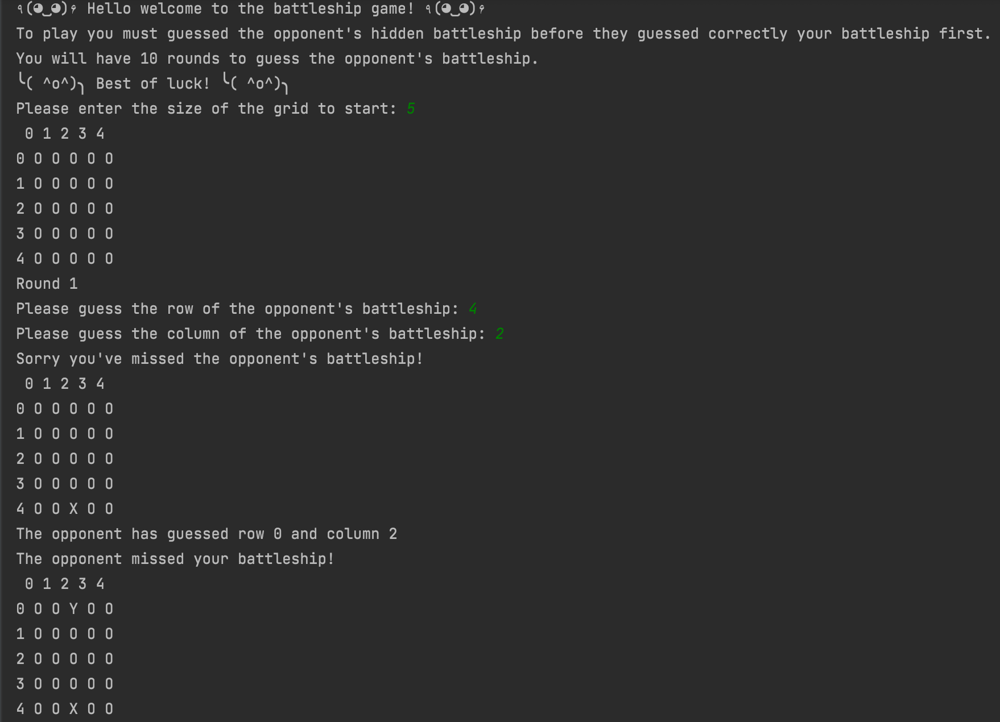
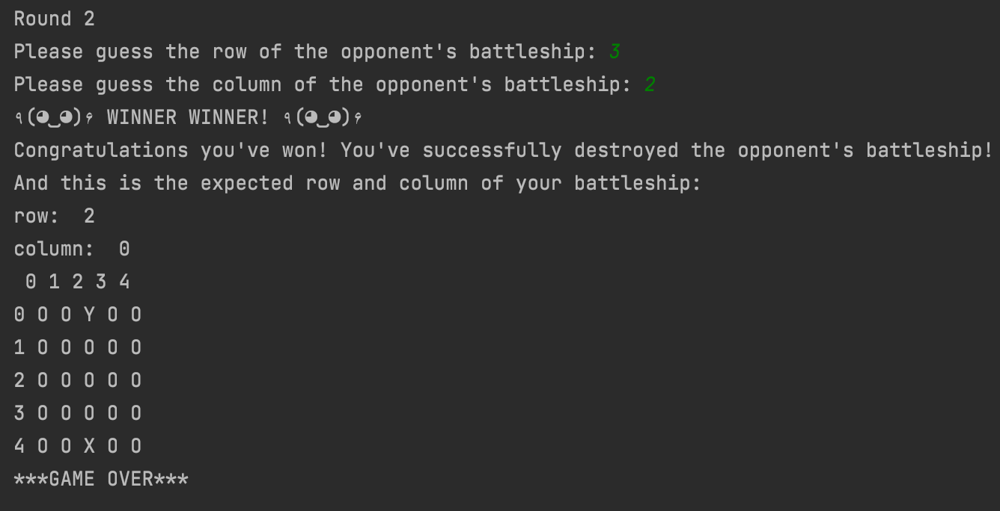
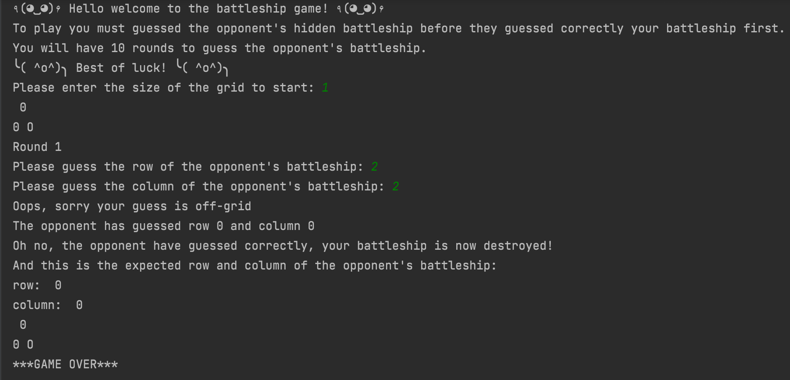
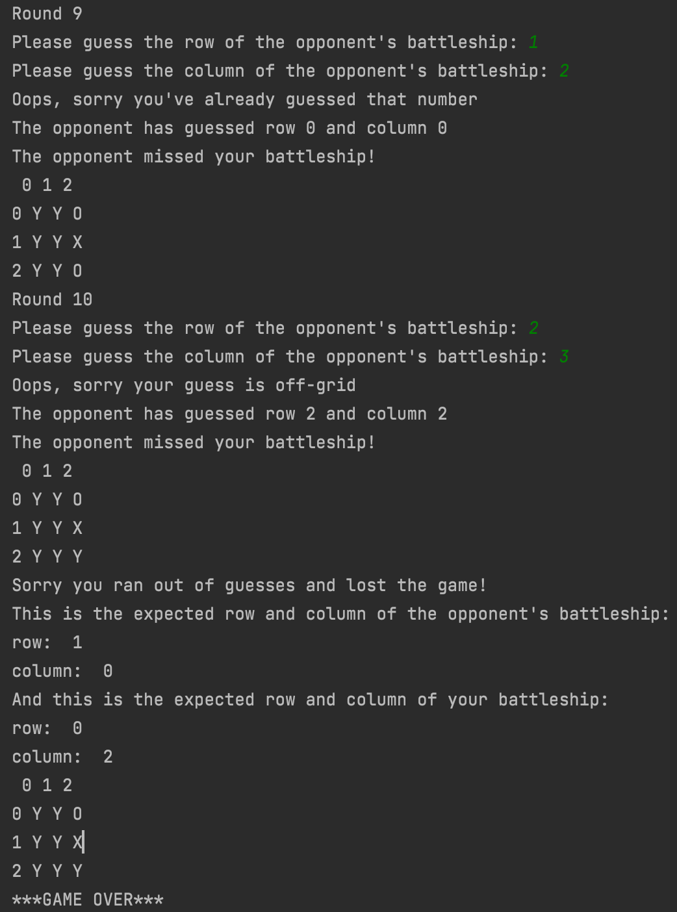
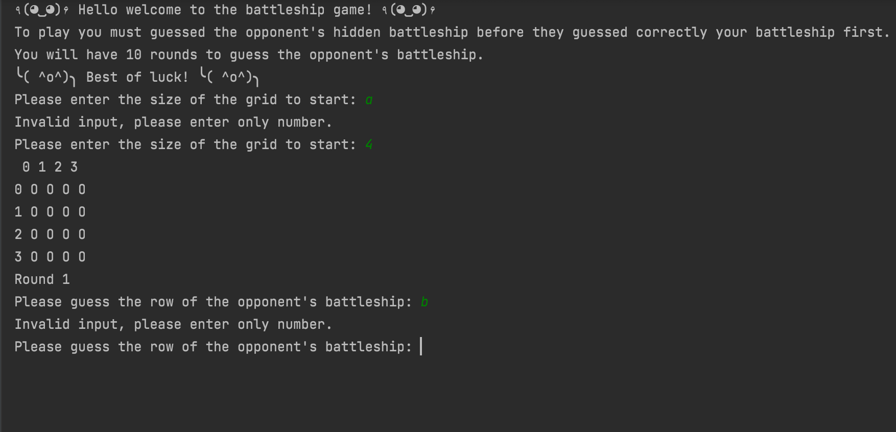

# Battleship Game

This is a python program that features a battleship game which involves two players, where each player has a grid representing a "ocean" on which they place "battleships" of various sizes. The location of each player's battleships are kept hidden from their opponent.

The objective of the game is to be the first player to sink all of their opponent's battleships. To accomplish this, the player and the computer opponent takes turns calling out a "grid coordinate" on their opponent's grid.

The first player to destroyed their opponent's battleships wins the game. The Battleship game can be played on various grid sizes, and can involve different numbers and sizes of battleships, making it a versatile and enjoyable game to play.

## Features 

The main feature allows the user to play a simple battleship game against the computer.
The game is played on a grid of user-defined size.
The player and the computer both have a battleship hidden somewhere on the grid, and they take turns guessing the location of each other's battleship.
The player has 10 turns to guess the computer's battleship, and the computer has 10 turns to guess the player's battleship.
If the player or the computer successfully guesses the location of the other's battleship, they win the game.
If neither the player nor the computer successfully guesses the location of the other's battleship within 10 turns, the game ends in a draw.
The program checks for valid user input, such as making sure the user enters a valid grid size and valid guesses for the location of the opponent's battleship.
The program prints out the game board after each turn to show the progress of the game.

### Features Left to Implement

Multiplayer mode: Currently, the game only supports a single player mode against the computer. A multiplayer mode could be implemented where two players can play against each other on separate grids.

Difficulty levels: The game could have multiple difficulty levels, ranging from easy to hard. The difficulty level could determine the size of the grid, the number of ships, and the number of guesses allowed.

High scores: A high score system could be implemented where the player's score is recorded and displayed at the end of the game. 

### Testing 

Test the input validation: I've made sure that the code correctly handles invalid input when the user enters non-numeric values or numbers outside of the grid size.

Test the board generation: I've also check that the board is generated correctly by printing it out and verifying that it matches the expected dimensions.

Test the ship placement: To ensure that the player and opponent ships are placed randomly on the board and that they do not overlap. I check this by printing out the row and column values of each ship and verifying that they are within the bounds of the board and do not overlap with each other.

Test the guessing logic: I've played the game several times and try different guessing scenarios to ensure that the guessing logic works as expected. 

Test the game ending: I've verify that the game ends correctly when either the player or the opponent correctly guesses the location of the other's ship, or when the player has used up all of their guesses.

### Output 

- __When the player win__

- __When the opponent win__

- __When the player ran out of guesses__

__Error checking__

### Validator Testing 

No python errors were found when passing through the official [Python validator](https://extendsclass.com/python-tester.html)

### Unfixed Bugs

The program should work as intened with no unfixed bugs.

## Deployment